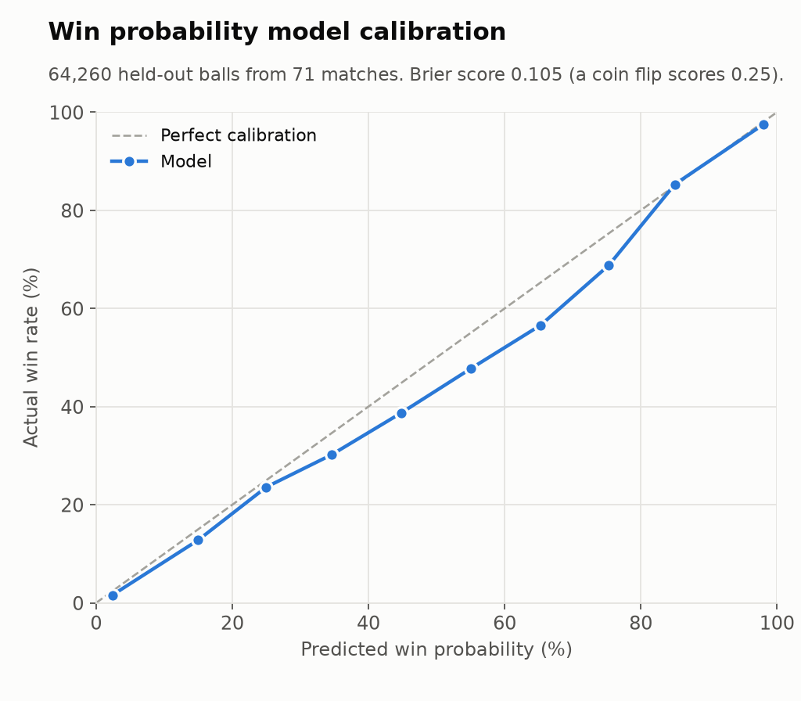
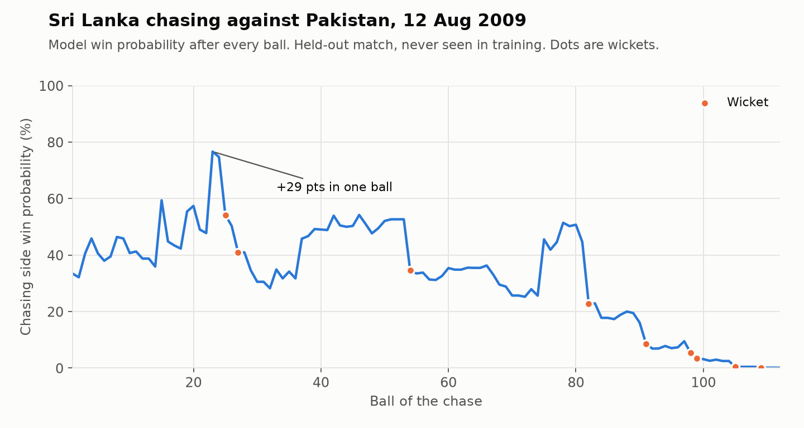
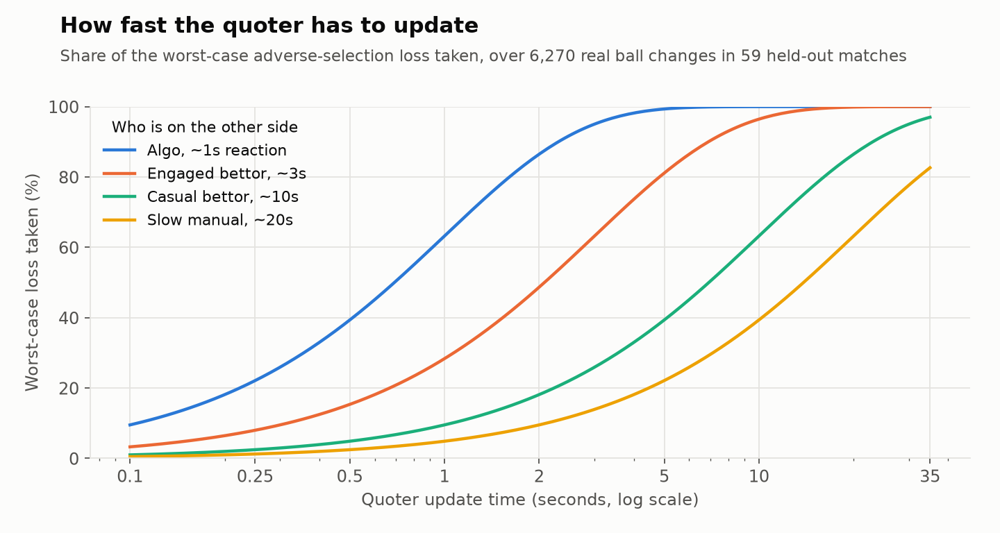

# Cricket Market Making Simulator

A new on-chain cricket prediction exchange asked us to be one of its first market makers. The book was empty, so there was no price history to backtest against. Before committing capital I built a fair value model and a quoting simulator to see what the risk would look like.

## Win probability model

Trained on ball-by-ball data for every men's T20 international chase in the public Cricsheet archive: 355 matches and 344,726 ball states. Inputs are runs needed, balls left, wickets in hand, required rate and current rate. Train and test are split by match, so no ball from a test match is seen in training.

On 71 held-out matches the gradient boosting model scores a Brier of 0.105, against 0.25 for a coin flip. It is slightly too confident about the chasing side in the 40 to 75% range, which is worth knowing before quoting around it.

The model's view of one held-out match. Win probability can move 20 to 30 points on a single ball, from a wicket or a six.

## Quoting simulator

The simulator replays 59 held-out matches ball by ball, quotes around the model price under the venue's market maker rules, and charges a loss whenever an informed trader hits a quote before it is updated. It sweeps how fast the quoter updates against how fast the other side reacts.

Against a fast algorithmic counterparty, updating within 2 seconds still gives up 86% of the worst-case loss. Keeping it under about 10% needs updates in around 0.1 seconds. The venue only offered polling, not a streaming feed, so that speed wasn't reachable.

## What I found

- Cricket prices jump, they don't drift. That makes stale quotes much more expensive than in most markets.
- The simulator only measures the cost side. With no trade history on the venue there was nothing real to estimate the revenue from normal order flow, and I didn't want to make that number up.
- While writing this up I found the latency script had the race probability inverted, which made slow updates look safe. I fixed it and reran everything. The corrected result is the one above, and it is the stricter one.
- Outcome: nothing was funded. Worth revisiting once the venue has real order flow and a streaming API.

## Stack

Python, pandas, scikit-learn (HistGradientBoostingClassifier), Cricsheet JSON, matplotlib.

Code is proprietary. More of my work: [work-portfolio](https://github.com/mjaun556-svg/work-portfolio)
